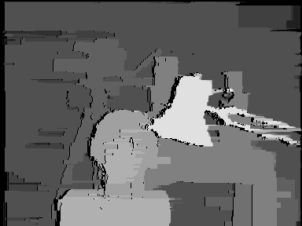
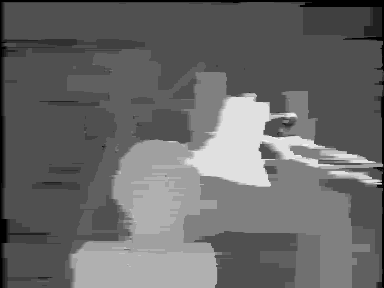

# Dynamic Programming for Stereo Matching
A Matlab implementation of Dynamic Programming Algorithm for stereo matching. It uses the "SAD" (Sum of Absolute Differences) similarity metric.

## Input Image
The Tsukuba stereo image that used as input.

   

## Output Image
The disparity map that created at the output.

   

## Output Image Without Occlusion
The disparity map without occluded pixels.

   

